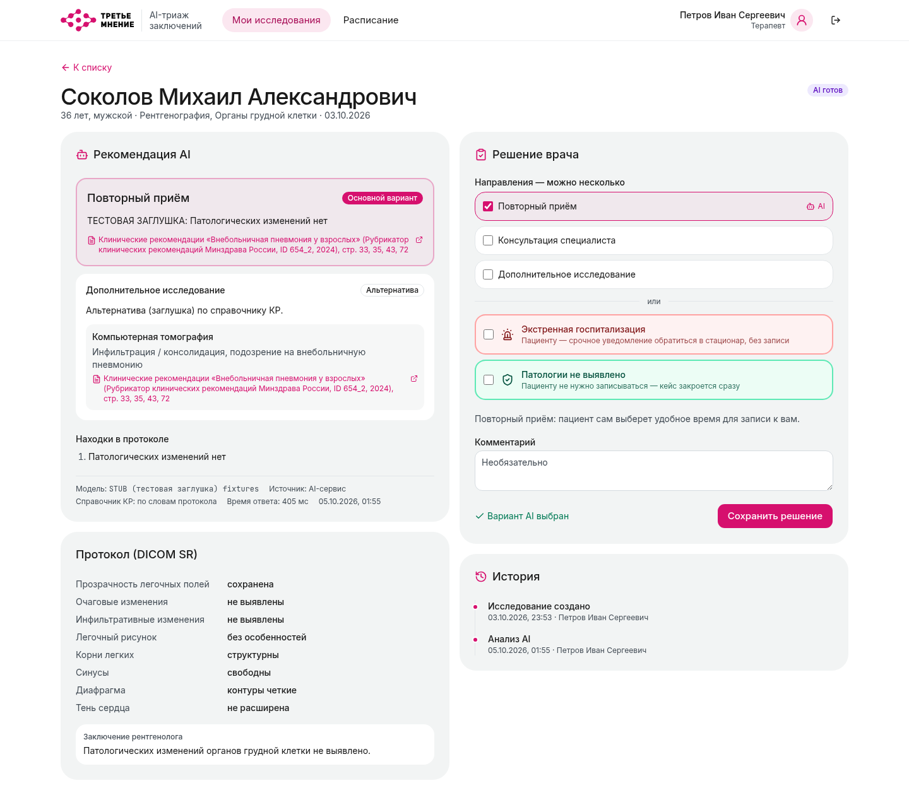
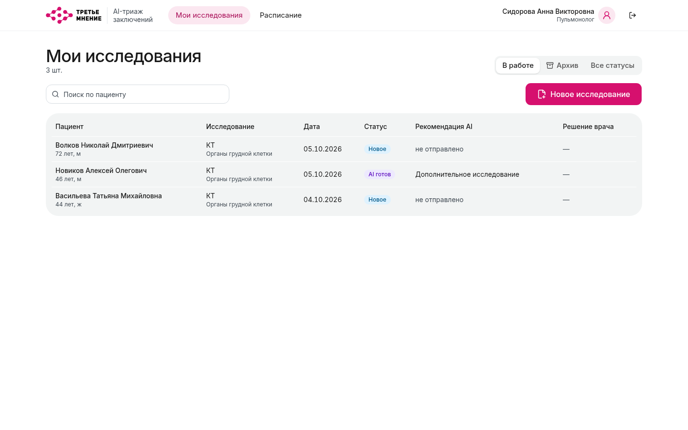
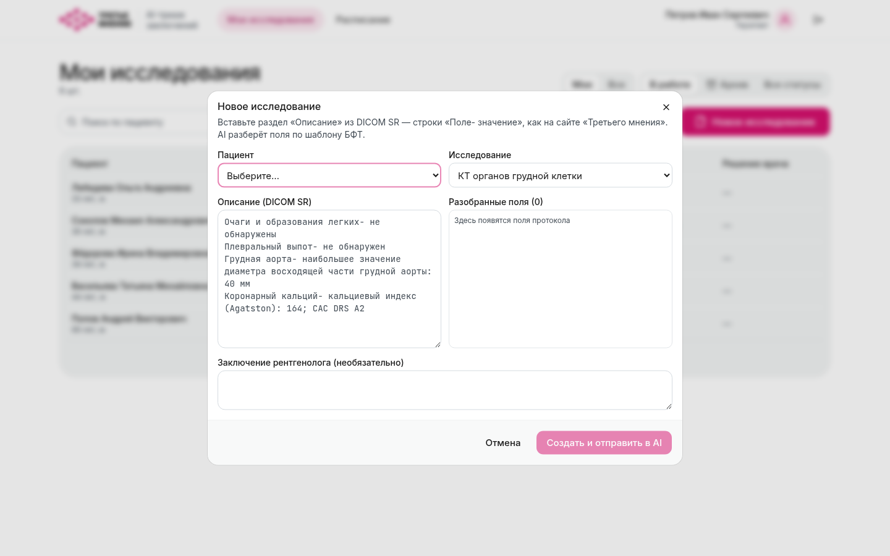
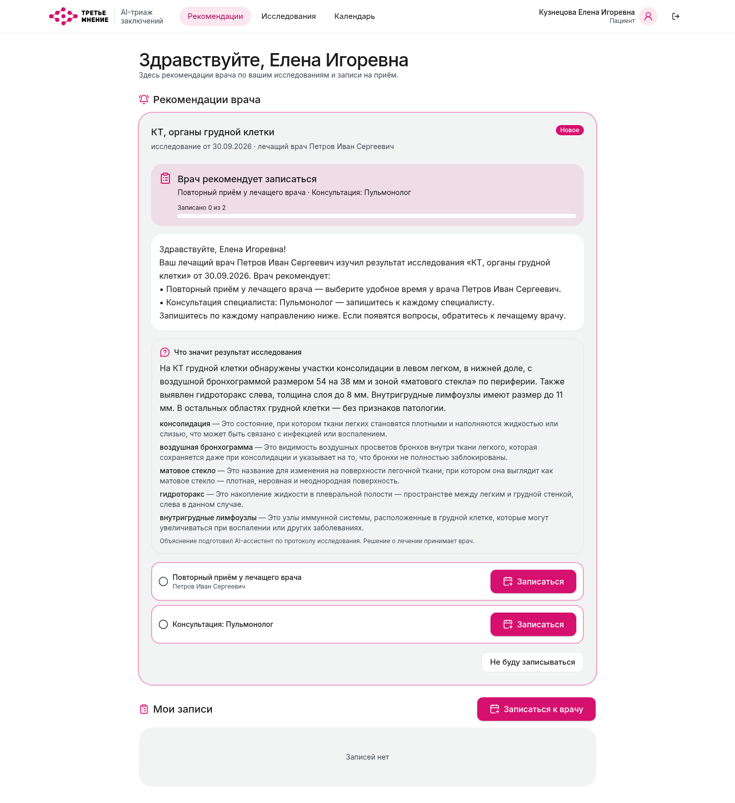
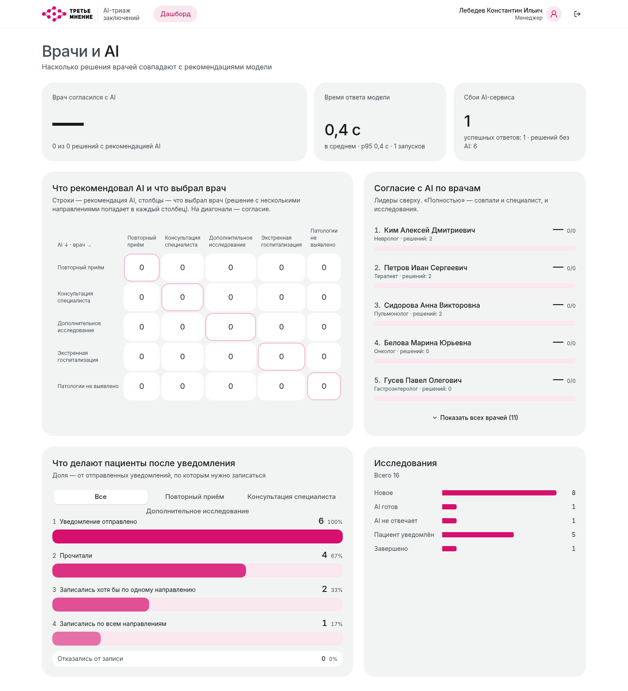
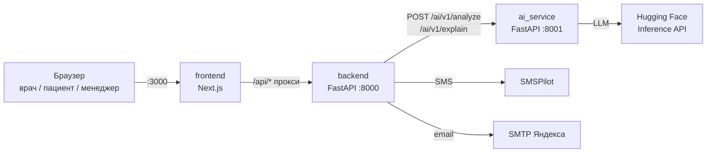

# Третье мнение: AI-триаж заключений лучевой диагностики

Веб-платформа для врача, пациента и руководителя клиники. AI-модель читает протокол исследования и предлагает маршрут пациента со ссылками на клинические рекомендации Минздрава. Решение принимает врач. Пациент получает уведомление и записывается по направлениям. Руководитель видит, насколько часто врачи соглашаются с AI, работает ли система как заявлено. 



## Содержание

1. [Цели и задачи](#1-цели-и-задачи)
2. [Что реализовано](#2-что-реализовано)
3. [Быстрый старт](#3-быстрый-старт)
4. [Входные и выходные данные, API](#4-входные-и-выходные-данные-api)
5. [Ограничения и особенности медицинской тематики](#5-ограничения-и-особенности-медицинской-тематики)
6. [Структура репозитория](#6-структура-репозитория)
7. [Конфигурация](#7-конфигурация)
8. [Тесты и нагрузка](#8-тесты-и-нагрузка)

## 1. Цели и задачи

**Цель.** Увеличить конверсию пациентов после получения ими анализов. Врачу — предоставить обоснованные рекомендации по дальнейшему маршруту пациента с возможностью самостоятельно принять окончательное решение.

**Задачи:**
- **Подсказка врачу.** По сырому протоколу исследования модель предлагает варианты маршрута:
  - повторный приём;
  - консультация специалиста;
  - дообследование;
  - экстренная госпитализация;
  - «патологии не выявлено».

  У каждого варианта — обоснование, сроки и ссылка на документ и страницу клинических рекомендаций.
- **Решение врача.** Врач подтверждает или меняет маршрут в один клик. Решение можно принять и без AI.
- **Пациент.**
  - Автоматическое уведомление: SMS, email + личный кабинет.
  - Запись по каждому направлению.
  - Регулярные напоминания, пока пациент не записался.
- **Руководитель.**
  - Согласие врачей с AI: в целом, по типам решений и по врачам.
  - Возвращение пациентов в клинику после уведомления.

## 2. Что реализовано

| Роль | Возможности |
|---|---|
| **Врач** | Очередь «В работе / Архив», поиск по пациенту, «Новое исследование» из протокола рентгенолога. Карточка: протокол в виде таблицы; варианты AI (основной + альтернативы) с причинами, сроками и ссылками на источники; форма решения (1–3 направления, специалисты, исследования; экстренная госпитализация и «патологии не выявлено» — отдельно). Уведомление пациента со статусами доставки, кнопка «Напомнить сейчас», таймлайн действий, расписание на неделю |
| **Главврач** | Видит исследования всех врачей (без принятия решений), создаёт исследования, меняет лечащего врача, управляет врачами |
| **Менеджер** | Дашборд: согласие с AI, матрица «AI ↔ врач» 5×5, совпадение деталей, уведомления, статистика по врачам, задержка модели |
| **Пациент** | Рекомендации врача, чек-лист направлений и запись в календаре, свои исследования и записи, контакты и каналы уведомлений |

**Как это работает.** Врач открывает карточку → протокол уходит в AI-сервис → врач видит варианты и принимает решение → пациенту сразу уходит уведомление → пациент записывается → кейс закрывается, когда закрыты все направления.

| | |
|---|---|
|  |  |
|  |  |

> На снимках — настоящие ответы модели (Qwen3-4B через Hugging Face). Если модель недоступна, интерфейс честно показывает «AI не отвечает», и врач работает без AI.

**Три сервиса** (подробнее — [docs/architecture.md](docs/architecture.md)):



- **`frontend/`** — сайт: Next.js 16, React 19, TanStack Query, shadcn/ui. В фирменном стиле заказчика «Третье мнение».
- **`backend/`** — API и бизнес-логика: FastAPI, Pydantic v2. Хранилище в памяти, при старте заполняется синтетическими данными.
- **`ai_service/`** — HTTP-обёртка над кодом AI-команды: промпт, шаблоны протоколов, справочник «находка → действие» из клинических рекомендаций, объяснение для пациента. Модель — LLM через Hugging Face Inference API.

## 3. Быстрый старт

### Требования

- **Docker** с Compose v2 (Docker Desktop или Docker Engine) — больше ничего ставить не нужно.
- Свободные порты 3000 и 8000.
- Для ответов модели — токен Hugging Face. Без него всё работает, исследования показывают «AI не отвечает».

### Запуск за 4 шага

**1. Скачайте проект**

```bash
git clone https://github.com/Sicera-Med/sitefortesting.git
cd sitefortesting
```

**2. Вставьте токен Hugging Face** — без него сайт работает, но вместо рекомендаций AI будет «AI не отвечает».

Получите токен: [huggingface.co/settings/tokens](https://huggingface.co/settings/tokens) → «Create new token» → тип **Read** (или Fine-grained с правом «Make calls to Inference Providers») → скопируйте строку вида `hf_…`.

Создайте файл настроек из шаблона:

```bash
cp config/ai_service.env.example config/ai_service.env
```

Откройте **`config/ai_service.env`** и вставьте токен после `HF_TOKEN=` (без кавычек и пробелов):

```ini
HF_TOKEN=hf_ваш_токен
MODEL=Qwen/Qwen3-4B-Instruct-2507
```

**3. Запустите**

```bash
docker compose up --build
```

Первая сборка занимает несколько минут. Готово, когда в логах появится `frontend-1 | ✓ Ready`.

**4. Откройте сайт:** http://localhost:3000 — войдите кнопкой быстрого входа (см. ниже).

- С телефона в той же Wi-Fi-сети — `http://<IP-компьютера>:3000`
- Документация API (Swagger) — http://localhost:8000/docs
- Остановить — `Ctrl+C`, после смены настроек — снова `docker compose up --build`
- Ошибка `failed to bind host port … address already in use` — порт 3000 или 8000 занят другой программой. Остановите её (узнать, какую: `sudo ss -ltnp | grep -E ':(3000|8000)'`) или поменяйте левое число в `ports` в `docker-compose.yml`, например `"8080:8000"`

#### Необязательно: настоящие SMS и email

```bash
cp config/backend.env.example config/backend.env
```

В **`config/backend.env`** заполните:

```ini
NOTIFY_REAL=true
# SMS: ключ API из кабинета smspilot.ru
SMSPILOT_API_KEY=ваш_ключ
# Email: ящик-отправитель и пароль приложения (id.yandex.ru → Безопасность → Пароли приложений)
SMTP_USER=ящик@yandex.ru
SMTP_PASSWORD=пароль_приложения
# Куда придут SMS и письма всех демо-пациентов
DEMO_CONTACT_PHONE=+79990000000
DEMO_CONTACT_EMAIL=you@example.com
# Адрес сайта в ссылках из SMS и писем
SITE_URL=http://<IP-компьютера>:3000
```

Без этого файла рассылки не отправляются — уведомления видны только в личном кабинете пациента.

### Демо-аккаунты

Пароль у всех — `demo`. На странице входа есть кнопки быстрого входа.

| Роль | Логин |
|---|---|
| Врач (терапевт) | `petrov@clinic.demo` (также `sidorova@`, `kim@clinic.demo`) |
| Главврач | `chief@clinic.demo` |
| Менеджер | `manager@clinic.demo` |
| Пациент | `kuznetsova@patient.demo`, `ivanov@patient.demo`, … |

### Демо-сценарий за 3 минуты

1. **Врач** `petrov@clinic.demo`. Откройте любое исследование со статусом «Новое» — протокол уйдёт в AI. Посмотрите варианты и источники, сохраните решение.
2. **«Новое исследование»** — вставьте протокол из [examples/sr/](examples/sr/), например `ct_chest_aorta.txt`. В предпросмотре видно разобранные поля.
3. **Пациент.** Зайдите под пациентом из этого исследования: уведомление, объяснение результата простым языком, кнопки «Записаться».
4. **Менеджер** `manager@clinic.demo` — дашборд согласия «AI ↔ врач».

### Без Docker (для разработки)

Нужны [uv](https://docs.astral.sh/uv/) и Node.js 20+:

```bash
./scripts/run-dev.sh        # ai_service :8001, backend :8000, сайт :3000
```

Или по отдельности:
- `cd backend && uv sync && uv run uvicorn app.main:app --reload`
- `cd ai_service && uv sync && uv run uvicorn main:app --port 8001`
- `cd frontend && npm install && npm run dev`

## 4. Входные и выходные данные, API

### Вход: протокол исследования

Протокол рентгенолога: описание находок построчно «Поле- значение», как на сайте Третьего мнения. Заключение рентгенолога в систему не берётся: рекомендацию AI строит по самим находкам. Технически это раздел «Описание» структурированного отчёта DICOM SR — по нему врачу и AI видно одно и то же. Поддерживаются следующие типы исследований: **КТ органов грудной клетки, РГ/ФЛГ органов грудной клетки, маммография, КТ головного мозга**.

```text
Грудная аорта- наибольшее значение диаметра восходящей части грудной аорты: 40 мм
Очаги и образования легких- не обнаружены
```

Модель получает поля дословно и разбирает их сама. Примеры — [examples/sr/](examples/sr/).

### Выход

- **Ответ AI:**
  - 1–3 варианта маршрута, один из них основной;
  - у каждого варианта — пункты (код специалиста или исследования из справочника клиники, причина, срок, ссылка на документ и страницу клинических рекомендаций);
  - находки в протоколе.

  Формат — [docs/ai-contract.md](docs/ai-contract.md), пример — [examples/ai_response.json](examples/ai_response.json).
- **Решение врача:** выбранные направления, специалисты и исследования, комментарий, согласие с AI (считает сервер).
- **Уведомление пациента:**
  - подробный текст в кабинете;
  - короткий текст со ссылкой — в email;
  - SMS без медицинских данных;
- **Метрики** для руководителя: `GET /api/v1/metrics/dashboard`.

### API

REST, префикс `/api/v1`, JWT в заголовке `Authorization: Bearer …`.

| Группа | Эндпоинты |
|---|---|
| Вход | `POST /auth/login`, `GET /auth/me` |
| Исследования (врач) | `GET/POST /studies`, `GET /studies/{id}`, `POST /studies/{id}/analyze`, `POST /studies/{id}/decision`, `GET /studies/{id}/audit` |
| Пациент | `GET /patients/me/notifications`, `POST /notifications/{id}/explain`, `GET /doctors/{id}/slots`, `POST /appointments` |
| Руководитель | `GET /metrics/dashboard` |

- Полный список с ролями — [docs/api.md](docs/api.md).
- Интерактивная документация — Swagger на `/docs`.
- Готовые запросы — [examples/api.http](examples/api.http).

## 5. Ограничения и особенности медицинской тематики

Подробнее — [docs/medical-limitations.md](docs/medical-limitations.md).

- **Не медицинское изделие.** Это демонстрационный прототип: он не зарегистрирован как медицинское изделие и не предназначен для принятия клинических решений.
- **AI только подсказывает.**
  - Решение всегда принимает врач, его можно принять и без AI.
  - Пациенту уходят шаблонные тексты по решению врача, а не ответ модели.
  - Модель только объясняет результат исследования простым языком: без диагнозов и назначений.
- **Модель может ошибаться.**
  - У каждого пункта видно, на какой документ и страницу клинических рекомендаций он опирается.
  - Если ссылка не подтверждается справочником, это помечено.
  - Если источника нет, пункт помечен как «предложение модели».
  - Справочник клинических рекомендаций ограничен рекомендациями Минздрава РФ: записи ещё не проверены врачом.
- **Экстренные состояния.** «Экстренная госпитализация» выбирается только отдельно: пациенту уходит срочное уведомление «обратитесь в стационар / 103», записи не требуется.
- **Только четыре типа исследований** с шаблонами БФТ. Изображения не анализируются — только текст протокола.
- **Персональные данные.**
  - Все данные синтетические.
  - SMS и email не содержат медицинских сведений — только ссылку на кабинет.
  - Внешняя LLM получает протокол без ФИО (только возраст и пол).
- **Доступность модели.** Hugging Face Inference API используется в текущем MVP.В дальнейшем планируется перевод модели на сервера компании. 

## 6. Структура репозитория

```
├── README.md
├── docker-compose.yml        # весь стенд одной командой
├── config/                   # настройки всех сервисов (*.env.example — шаблоны)
├── backend/                  # API (FastAPI)
│   ├── app/
│   │   ├── api/v1/           # HTTP-роутеры
│   │   ├── services/         # бизнес-логика, AI, уведомления, рассылки, метрики
│   │   ├── domain/           # модели, правила маршрута, разбор протокола, тексты пациенту
│   │   ├── ai/               # контракт с AI-сервисом и HTTP-клиент
│   │   ├── schemas/          # DTO API
│   │   └── seed/             # демо-набор (data.py) и его загрузка
│   ├── tests/
│   └── Dockerfile
├── ai_service/               # HTTP-обёртка над моделью AI-команды
│   ├── main.py               # /ai/v1/analyze, /ai/v1/explain
│   ├── analysis.py, guidelines.py, guidelines/, bft_templates.*, b2c.py   # код AI-команды
│   ├── source_urls.json      # ссылки на официальные страницы клинических рекомендаций
│   ├── tests/
│   └── Dockerfile
├── frontend/                 # сайт (Next.js)
│   ├── src/app/              # страницы по ролям
│   ├── src/components/
│   ├── src/lib/api/          # клиент API и типы
│   └── Dockerfile
├── docs/                     # архитектура, API, AI-контракт, ограничения, нагрузка, скриншоты
├── examples/                 # демо-протоколы, примеры запросов и ответов
└── scripts/                  # запуск без Docker, нагрузочный тест
```

## 7. Конфигурация

Все настройки — в папке [`config/`](config/). В git лежат только шаблоны `*.env.example`, рабочие `*.env` с ключами в репозиторий не попадают.

| Файл | Главное |
|---|---|
| `config/backend.env` | `SITE_URL` — адрес сайта для ссылок в SMS; рассылки: `NOTIFY_REAL`, `SMSPILOT_API_KEY`, `SMTP_USER`, `SMTP_PASSWORD`; `DEMO_CONTACT_PHONE` / `DEMO_CONTACT_EMAIL` — общие контакты демо-пациентов; `JWT_SECRET` |
| `config/ai_service.env` | `HF_TOKEN`, `MODEL` |
| `config/frontend.env.example` | `BACKEND_INTERNAL_URL` — справка; в Docker уже задано |

Рассылки: с `NOTIFY_REAL=true` и ключами SMS уходят через SMSPilot, письма — через SMTP (по умолчанию Яндекс). Каждая отправка видна врачу в истории со статусом: отправлено, в очереди или ошибка с причиной. При `NOTIFY_REAL=false` (значение по умолчанию, для разработки) ничего не отправляется, в истории — «не отправлено».

## 8. Тесты и нагрузка

```bash
cd backend && uv run pytest && uv run ruff check .                 # 140 тестов
cd ai_service && uv run pytest                                      # обёртка AI, модель подменена
cd frontend && npx tsc --noEmit && npx eslint src && npm run build
```

Тесты не обращаются к модели, SMS и почте: внешние вызовы подменены.

**Нагрузочный тест без AI:**

```bash
uv run --project backend python scripts/loadtest.py --users 10,50,100 --duration 30
```

Сценарии: врачи, пациенты и менеджер работают одновременно. При 100 одновременных пользователях ошибок нет. Результаты и найденное узкое место — [docs/load-testing.md](docs/load-testing.md).
