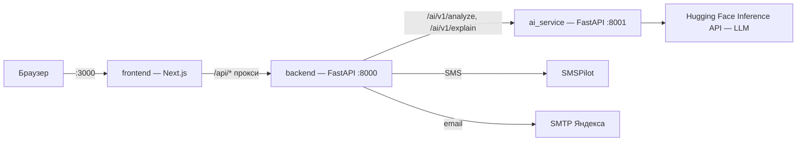

# Архитектура

## Сервисы



| Сервис | Что делает | Технологии |
|---|---|---|
| `frontend` | Сайт для четырёх ролей. Клиентское SPA: JWT в `localStorage`, данные — TanStack Query. Запросы `/api/*` проксируются на backend (`next.config.ts`), поэтому сайт работает на одном порту и открывается с телефона | Next.js 16, React 19, shadcn/ui (Base UI), Tailwind 4 |
| `backend` | API, права, бизнес-правила маршрута пациента, вызов AI, уведомления и рассылки, запись, метрики. Хранилище в памяти, при старте заполняется демо-набором | FastAPI, Pydantic v2, httpx |
| `ai_service` | HTTP-обёртка над кодом AI-команды: промпт, шаблоны протоколов БФТ, справочник «находка → действие», проверка ответа модели, ссылки на источники, объяснение для пациента | FastAPI, huggingface_hub |

## Слои backend

```
api/v1/      HTTP: роутеры, проверка ролей (api/deps.py), DTO — schemas/
services/    бизнес-логика + аудит (services/audit.record); FastAPI не импортируют
domain/      модели, перечисления, правила (rules.py), разбор DICOM SR (sr.py), тексты пациенту
ai/          контракт с AI-сервисом (contract.py), HTTP-провайдер, mock — только для тестов
store.py     хранилище в памяти с индексами по связям
seed/        демо-набор (data.py) и его загрузка (demo.py)
```

Фоновые задачи в процессе backend:
- `services/outbox.py` — очередь отправки SMS и email: решение врача не ждёт внешних сервисов;
- `services/reminders.py` — напоминания пациенту раз в неделю, до трёх раз, пока он не записался;
- `services/auto_analyze.py` — автоотправка в AI; выключена, в AI отправляет открытие карточки.

## Поток данных

```mermaid
sequenceDiagram
    actor D as Врач
    participant A as backend
    participant M as ai_service
    actor P as Пациент
    D->>A: POST /studies (поля DICOM SR)
    D->>A: открывает карточку → POST /studies/{id}/analyze
    A->>M: report_text = «Описание: … Заключение: …», возраст, пол
    M->>M: промпт + шаблон БФТ + справочник КР → LLM → validate → источники
    M-->>A: options[], reasons[]
    A-->>D: варианты AI со ссылками на КР
    D->>A: POST /studies/{id}/decision
    A->>A: accepted_ai, снапшот AI; уведомление → очередь отправки
    A-->>P: SMS / email / кабинет
    P->>A: POST /notifications/{id}/explain → объяснение простым языком
    P->>A: POST /appointments (по каждому направлению)
    A->>A: все направления закрыты → исследование «завершено»
```

## Статусы исследования

```
new ──AI──► ai_ready ──решение──► decided ──авто──► notified ──запись по всем направлениям──► completed
 │            ▲                      ▲                │
 └──сбой──► ai_failed ──решение──────┘                └─ экстренная госпитализация / патологии нет / отказ ─► completed
```

Решение можно принять в любой момент, с AI или без. Таблица переходов — `backend/app/domain/rules.py`.

## Ключевые решения

- **В AI уходят сырые поля протокола**, а не готовый текст. Модель разбирает их сама — по шаблону БФТ и справочнику.
- **Ответ AI неизменяем**, решение хранит его снимок. Повторный анализ не меняет уже посчитанные метрики.
- **`accepted_ai` считает сервер:** вариант AI есть среди выбранных врачом.
- **Мягкая валидация ответа модели:** неизвестные коды отбрасываются с предупреждением. Демо не падает из-за мелких расхождений формата.
- **Тексты пациенту — шаблоны** по решению врача. Модель только объясняет заключение — так же устроено у AI-команды.
- **Лимит частоты** отправки в AI, объяснения и «Напомнить сейчас» — раз в 10 с (`services/cooldown.py`): бережёт кредиты модели и SMS.
